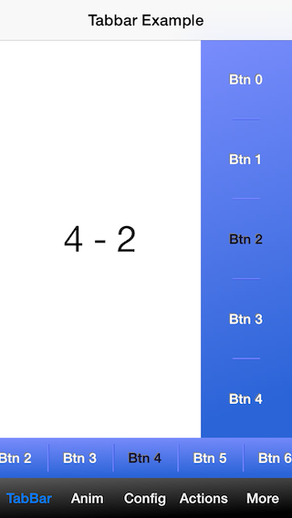
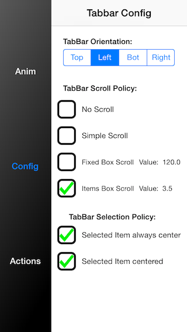

JJlibUI - simplify UI

To help build new UI easy and customizable.
Support for iOS 5.0 and superior.

	Current build: v0.4

### TabBar inside tabbar's

### TabBarController customizable

### Easy to setup animations and transitions

	Functionality :
 		- Simulate radio buttons with button's.
 		- A bar that will help layout your subviews horizontal and vertical with or without scroll.
 		- Full flexible and customizable tabbar.
 		- Create new custom TabBarController's 		

	Avaiable soon :
		- UIAppearance compliant.
		- Storyboard integration.
		- More examples
		- CocoPods integration

Suggestions and Contributions email: joaofrjesusbe at gmail.com

License: MIT License
