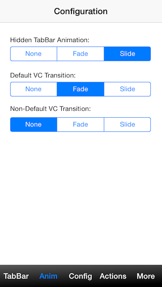
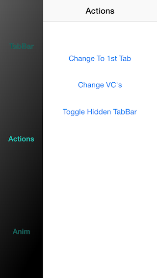

###JJlibUI - simplify UI

To help build new UI easy and customizable.
Support for iOS 5.0 and superior.

Current build: v0.4

### How to create

	// Create a controller 1
	UIViewController *viewController1 = [[UIViewController alloc] initWithNibName:nil bundle:nil];
    viewController1.jTabBarButton = [UIButton buttonWithType:UIButtonTypeContactAdd];

	// Create a controller 2
    UIViewController *viewController2 = [[UIViewController alloc] initWithNibName:nil bundle:nil];
    viewController2.jTabBarButton = [UIButton buttonWithType:UIButtonTypeInfoDark];

    // Add to tabbarController
	_tabBarController = [[JTabBarController alloc] initWithSize:CGSizeMake(88,44) andDockPosition:JTabBarDockBottom];
    _tabBarController.childViewControllers = @[ controller1, controller2];
    [self addChildViewController:_tabBarController];
    [self.view addSubview:_tabBarController.view];
    [_tabBarController didMoveToParentViewController:self];

### TabBar More features

###Functionality :
 - Perseonalize your TabBar.
 - Easy customize transitions.
 - Choose the TabBar orientation.
 - Use your favorite UIControl to use with your JTabBarController.	

###More:

Suggestions and Contributions email: joaofrjesusbe at gmail.com

License: MIT License
